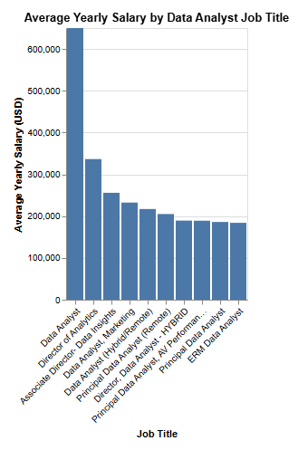
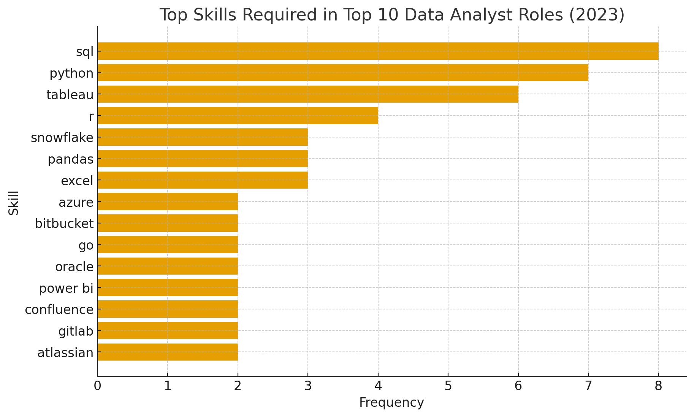

# Introduction
📊 Take a journey through the data analytics job market! This project explores 💰 top-paying data analyst roles, 🔥 trending skills, and 📈 where demand and salary meet for the best career opportunities in analytics.

🔍 Want to see the SQL behind it? Check here: [project_sql folder](/project_sql/)

# Background
This project was created to better understand the data analyst career landscape — finding which roles and skills lead to the best pay, helping others make smarter decisions about where to focus their learning efforts.

The dataset comes from [Luke Barousse SQL Course](https://lukebarousse.com/sql), which includes detailed information on job positions, salaries, locations, and relevant skills.

### The key questions I aimed to answer using SQL were:

1. Which data analyst jobs offer the highest salaries?
2. What skills are required for those top-paying roles?
3. Which skills are most commonly requested for data analysts?
4. What skills tend to be linked with higher pay?
5. Which skills strike the best balance between salary and demand?

# Tools I Used
To uncover insights into the data analytics job market, I used several important tools:

- **SQL:** The foundation of my research — used to clean, filter, and analyze the data.
- **PostgreSQL:** My database management system for storing and querying the job data.
- **Visual Studio Code:** My primary editor for writing and executing SQL scripts.
- **Git & GitHub:** For version control, documentation, and sharing the project publicly.

# The Analysis
Each SQL query focused on one of the core research questions. Below is a breakdown of the steps and findings.

### 1. Top Paying Data Analyst Jobs
To identify the highest-paying data analyst roles, I filtered listings by salary and location, prioritizing remote work opportunities.

```sql
SELECT 
    job_id,
    job_title,
    job_location,
    job_schedule_type,
    salary_year_avg,
    job_posted_date,
    name AS company_name
FROM
    job_postings_fact
LEFT JOIN company_dim ON job_postings_fact.company_id = company_dim.company_id
WHERE 
    job_title_short = 'Data Analyst' AND
    job_location = 'Anywhere' AND
    salary_year_avg IS NOT NULL
ORDER BY
    salary_year_avg DESC
LIMIT 10
```
Here’s what the results revealed for 2023:

- **Salary Range:** The top 10 roles offered salaries from **$184K** up to **$650K**, showing a wide pay scale.  
- **Diverse Employers:** Organizations like **SmartAsset**, **Meta**, and **AT&T** stand out for offering high salaries.  
- **Varied Job Titles:** The listings range from *Data Analyst* to *Director of Analytics*, reflecting diverse career paths.

  
*Bar chart showing the salary comparison for the top 10 highest-paying data analyst jobs.*

### 2. Identifying Essential Skills for Premium Roles
To uncover the proficiencies highly valued by employers for well-compensated positions, I integrated job vacancy details with skill data. This approach illuminates the specific capabilities that command top salaries in the market.

```sql
WITH top_paying_jobs AS(
    SELECT 
        job_id,
        job_title,
        job_location,
        job_schedule_type,
        salary_year_avg,
        job_posted_date,
        name AS company_name
    FROM
        job_postings_fact
    LEFT JOIN company_dim ON job_postings_fact.company_id = company_dim.company_id
    WHERE 
        job_title_short = 'Data Analyst' AND
        job_location = 'Anywhere' AND
        salary_year_avg IS NOT NULL
    ORDER BY
        salary_year_avg DESC
    LIMIT 10
)
SELECT 
    top_paying_jobs.*,
    skills
FROM top_paying_jobs
INNER JOIN skills_job_dim ON top_paying_jobs.job_id = skills_job_dim.job_id
INNER JOIN skills_dim ON skills_job_dim.skill_id = skills_dim.skill_id
ORDER BY 
    salary_year_avg DESC
```

A concise summary of the most sought-after skills for the ten highest-paying data analyst positions in 2023 reveals:
- **SQL** demonstrates overwhelming prominence, appearing in 8 of these roles.
- **Python** is nearly as critical, identified in 7 instances.
- **Tableau** also holds significant weight, present in 6 job descriptions.
Competencies such as **R**, **Snowflake**, **Pandas**, and **Excel** also appear, indicating a diverse range of secondary requirements.


*Visual representation: A bar chart illustrating the frequency of skills associated with the top 10 highest-paying data analyst jobs, generated from the SQL query output.*


### 3. Understanding Widespread Skill Requirements for Data Analysts

This query was instrumental in pinpointing the competencies most frequently cited in job advertisements, thereby highlighting areas of significant market demand.

```sql
SELECT 
    skills,
    COUNT(skills_job_dim.job_id) AS demand_count
FROM job_postings_fact
INNER JOIN skills_job_dim ON job_postings_fact.job_id = skills_job_dim.job_id
INNER JOIN skills_dim ON skills_job_dim.skill_id = skills_dim.skill_id
WHERE job_title_short = 'Data Analyst'
GROUP BY
    skills
ORDER BY
    demand_count DESC
LIMIT 5
```
A synopsis of the prevailing skills demanded from data analysts in 2023 indicates:
- **SQL** and **Excel** consistently surface as foundational proficiencies, underlining their enduring importance in data manipulation and fundamental analysis.
- The necessity for **Programming** and **Visualization Tools** such as **Python**, **Tableau**, and **Power BI** is evident, signifying the increasing premium placed on technical abilities for data interpretation and communication.

| Skills   | Demand Count |
|----------|--------------|
| SQL      | 7291         |
| Excel    | 4611         |
| Python   | 4330         |
| Tableau  | 3745         |
| Power BI | 2609         |

*Data Table: A summary of the top 5 most demanded skills in data analyst job listings, ranked by frequency.*

### 4. Correlation Between Skills and Compensation Levels

By examining the average remuneration tied to various skills, this investigation brought to light which proficiencies command the highest salaries.

```sql
SELECT 
    skills,
    ROUND(AVG(salary_year_avg), 0) AS avg_salary
FROM job_postings_fact
INNER JOIN skills_job_dim ON job_postings_fact.job_id = skills_job_dim.job_id
INNER JOIN skills_dim ON skills_job_dim.skill_id = skills_dim.skill_id
WHERE job_title_short = 'Data Analyst'
    AND salary_year_avg IS NOT NULL
GROUP BY
    skills
ORDER BY
    avg_salary DESC
LIMIT 25
```
Observations from the analysis of skills linked to peak data analyst salaries reveal:
- **Significant Value in Big Data & Machine Learning:** Analysts proficient in technologies like PySpark and Couchbase, alongside machine learning platforms (DataRobot, Jupyter) and Python libraries (Pandas, NumPy), frequently secure the highest salaries. This underscores the industry's strong emphasis on advanced data processing and predictive modeling expertise.
- **Rewarding Software Development & Deployment Skills:** A strong understanding of development and deployment tools (GitLab, Kubernetes, Airflow) indicates a financially advantageous overlap between data analysis and engineering disciplines, with substantial compensation for capabilities that streamline automation and efficient data pipeline management.
- **Cloud Computing Prowess Pays Off:** Experience with cloud platforms and data engineering tools (Elasticsearch, Databricks, GCP) highlights the increasing importance of cloud-centric analytical environments. Possessing such expertise demonstrably enhances earning potential within data analytics roles.

| Skills        | Average Salary ($) |
|---------------|-------------------:|
| pyspark       |            208,172 |
| bitbucket     |            189,155 |
| couchbase     |            160,515 |
| watson        |            160,515 |
| datarobot     |            155,486 |
| gitlab        |            154,500 |
| swift         |            153,750 |
| jupyter       |            152,777 |
| pandas        |            151,821 |
| elasticsearch |            145,000 |

*Data Table: A ranked list of the average salaries associated with the top 10 highest-paying skills for data analysts.*

### 5. Cultivating the Most Impactful Skills for Career Growth

By integrating findings from both demand and salary data, this query aimed to pinpoint skills that offer a strategic advantage, being simultaneously highly sought-after and commanding superior remuneration. This provides a clear roadmap for professional development.

```sql
WITH skills_demand AS (
    SELECT 
        skills_dim.skill_id,
        skills_dim.skills,
        COUNT(skills_job_dim.job_id) AS demand_count
    FROM job_postings_fact
    INNER JOIN skills_job_dim ON job_postings_fact.job_id = skills_job_dim.job_id
    INNER JOIN skills_dim ON skills_job_dim.skill_id = skills_dim.skill_id
    WHERE job_title_short = 'Data Analyst'
        AND salary_year_avg IS NOT NULL
        AND job_work_from_home = True
    GROUP BY
        skills_dim.skill_id
), average_salary AS(
    SELECT 
        skills_job_dim.skill_id,
        ROUND(AVG(salary_year_avg), 0) AS avg_salary
    FROM job_postings_fact
    INNER JOIN skills_job_dim ON job_postings_fact.job_id = skills_job_dim.job_id
    INNER JOIN skills_dim ON skills_job_dim.skill_id = skills_dim.skill_id
    WHERE job_title_short = 'Data Analyst'
        AND salary_year_avg IS NOT NULL
        AND job_work_from_home = True
    GROUP BY
        skills_job_dim.skill_id
)

SELECT 
    skills_demand.skill_id,
    skills_demand.skills,
    demand_count,
    avg_salary
FROM 
    skills_demand
INNER JOIN average_salary ON skills_demand.skill_id = average_salary.skill_id
WHERE 
    demand_count>10
ORDER BY
    demand_count DESC,
    avg_salary DESC
LIMIT 25
```

| Skill ID | Skills     | Demand Count | Average Salary ($) |
|----------|------------|--------------|-------------------:|
| 8        | go         | 27           |            115,320 |
| 234      | confluence | 11           |            114,210 |
| 97       | hadoop     | 22           |            113,193 |
| 80       | snowflake  | 37           |            112,948 |
| 74       | azure      | 34           |            111,225 |
| 77       | bigquery   | 13           |            109,654 |
| 76       | aws        | 32           |            108,317 |
| 4        | java       | 17           |            106,906 |
| 194      | ssis       | 12           |            106,683 |
| 233      | jira       | 20           |            104,918 |

*Data Table: The most advantageous skills for data analysts, ranked by average salary, considering both demand and compensation.*

Here's an overview of the most strategic skills for Data Analysts in 2023:
- **Prevalent Programming Languages:** Python and R exhibit high demand, with counts of 236 and 148 respectively. Although highly sought-after, their average salaries hover around $101,397 for Python and $100,499 for R, suggesting widespread proficiency but consistent value.
- **Cloud Platform and Technology Acumen:** Expertise in specialized tools like Snowflake, Azure, AWS, and BigQuery is met with significant demand and robust average salaries, underscoring the escalating importance of cloud-based solutions and big data technologies in analytical roles.
- **Business Intelligence and Data Storytelling Tools:** Tableau and Looker, with demand counts of 230 and 49 respectively, and average salaries around $99,288 and $103,795, highlight the indispensable role of data visualization and BI in transforming raw data into actionable insights.
- **Database Management Expertise:** The ongoing need for proficiency in both traditional and NoSQL databases (Oracle, SQL Server, NoSQL) — with average salaries ranging from $97,786 to $104,534 — reaffirms the critical role of data storage, retrieval, and governance in the field.

# Key Takeaways

Throughout this analytical endeavor, my SQL capabilities have been significantly refined:

- **🧩 Sophisticated Query Construction:** I've honed my ability to construct intricate SQL queries, expertly joining diverse datasets and leveraging Common Table Expressions (WITH clauses) for streamlined data manipulation.
- **📊 Data Summarization Proficiency:** I've become adept at utilizing `GROUP BY` and aggregate functions like `COUNT()` and `AVG()` to distill vast datasets into meaningful summaries.
- **💡 Practical Analytical Application:** This project has enhanced my capacity to translate real-world business questions into effective, insightful SQL queries.

# Concluding Remarks

### Derived Understandings
The analysis yielded several overarching conclusions:

1.  **High-Earning Remote Data Analyst Roles**: Remote data analyst positions offer a considerable salary spectrum, with top earners reaching an impressive $650,000 annually.
2.  **Fundamental Skills for Elite Compensation**: Attaining high-paying data analyst roles often necessitates advanced command of SQL, indicating its foundational importance for superior earning potential.
3.  **Dominant In-Demand Skills**: SQL stands out as the most frequently requested skill in the data analyst job market, making its mastery crucial for job seekers.
4.  **Premium for Niche Expertise**: Specialized skills, such as SVN and Solidity, correlate with the highest average salaries, emphasizing the value of unique and less common proficiencies.
5.  **Strategic Skill Acquisition for Market Advantage**: SQL emerges as a prime skill to cultivate for data analysts, balancing both high demand and substantial average salaries, thereby maximizing professional market value.

### Final Reflections

This project not only solidified my SQL expertise but also provided invaluable perspectives on the current data analyst employment landscape. The findings serve as a practical guide for strategizing skill development and targeting job search efforts. By concentrating on skills that combine high demand with attractive salaries, aspiring data analysts can better position themselves for success in a competitive field. This undertaking underscores the critical need for continuous learning and adaptability in response to evolving industry trends within data analytics.